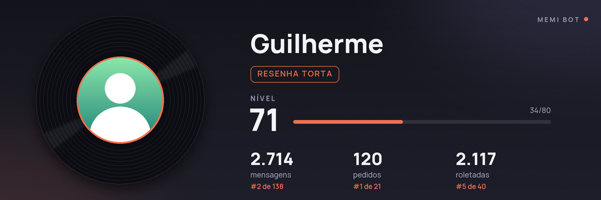
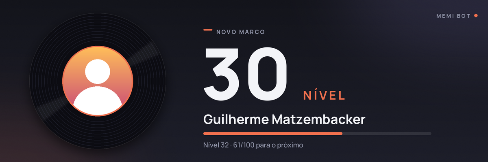
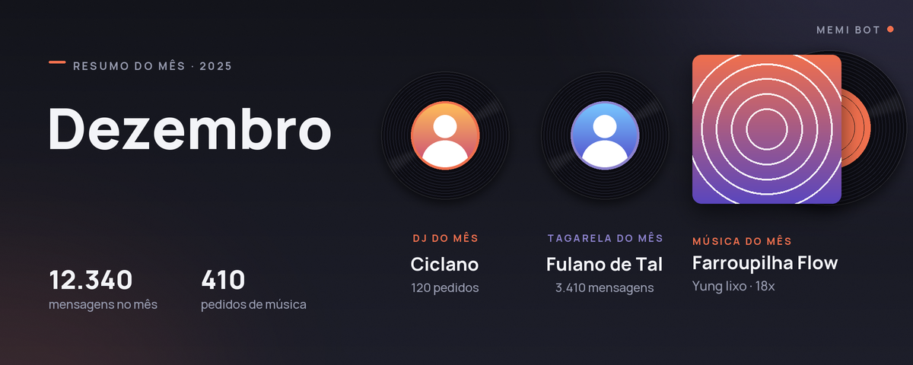

# MeMi BOT

Bot para Discord com rankings de música, atividade, perfis, níveis, conquistas e
recuperação de histórico. A documentação completa de instalação e comandos está em
[LEIA-ME.md](./LEIA-ME.md).

## Visual

O bot gera imagens no mesmo estilo para o `mm!help`, o `mm!cartao`, o aviso de level up, o resumo
do mês e o `mm!wrapped` (amostras em [docs/amostras](./docs/amostras/)):





## Requisitos

- Python 3.10 ou superior
- Um aplicativo de bot criado no [Discord Developer Portal](https://discord.com/developers/applications)
- Message Content Intent habilitada no portal (a Server Members Intent é recomendada, mas opcional)

## Instalação

```powershell
python -m venv .venv
.\.venv\Scripts\Activate.ps1
python -m pip install -r requirements.txt
Copy-Item token.txt.example token.txt
Copy-Item config.example.json config.json
```

Edite `token.txt` com o token do bot. Em `config.json`, configure os IDs do dono e do
canal de avisos; os valores locais são ignorados pelo Git. O `memi.db` é criado pelo
bot e guarda dados do servidor. Nunca compartilhe esses arquivos.

```powershell
python memi_bot.py
```

Para rodar com um ícone na bandeja do Windows (e iniciar junto com o sistema), veja
"Ícone na bandeja do Windows" no [LEIA-ME.md](./LEIA-ME.md); ele precisa de
`python -m pip install -r requirements-tray.txt`.

As imagens do bot (`mm!cartao`, level up, resumos, `mm!wrapped` e o banner da ajuda) usam o
Pillow, que já vem no `requirements.txt`. Sem ele, o bot funciona normalmente e as mensagens
saem só em texto. `mm!changelog` mostra as mudanças de cada versão.

## Testes

```powershell
python -m unittest discover -v -p "test_*.py"
```

Os testes usam dados temporários e não conectam ao Discord. A integração contínua executa
essa suíte (Python 3.10 e 3.12) e confere a formatação com o `black` em cada push e pull
request.

## Contribuições

Leia [CONTRIBUTING.md](./CONTRIBUTING.md) antes de abrir uma issue ou pull request.
Este projeto segue o [Código de Conduta](./CODE_OF_CONDUCT.md) e está sob a licença
[MIT](./LICENSE).
